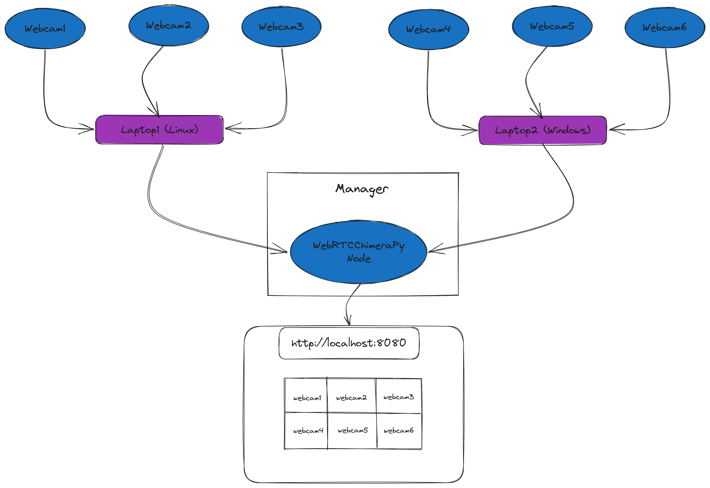
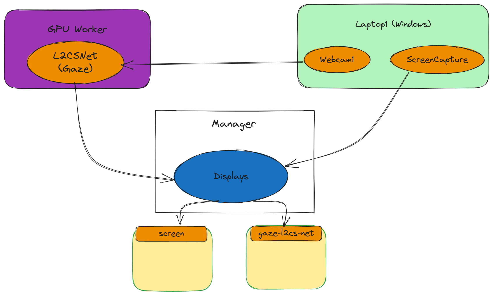

# MMLAPipeline-Resources
Demos, posters and other resources related to the [`ChimeraPy`](https://github.com/oele-isis-vanderbilt/ChimeraPy.git) MMLA Pipeline ecosystem for EngageAI Institute site visit 2023.

## Posters
1. [ChimeraPy and the MMLAPipeline](./posters/ChimeraPyPoster.pdf)

## Demos
1. [multi-camera.json](./demos/multi-camera.json): [`ChimeraPyOrchestrator`](https://github.com/oele-isis-vanderbilt/ChimeraPyOrchestrator.git) config streaming multiple web cameras. This requires 2 external webcams (along with the native webcams) connected to a `linux` and `windows` machine. In the manager, we also run a [`webrtc-chimerapy-node`](https://github.com/oele-isis-vanderbilt/webrtc-chimerapy-node.git).

The architecture is as follows:
 
 
 

https://github.com/oele-isis-vanderbilt/MMLAPipeline-Resources/assets/11476842/d9c4ff67-d4a3-495e-b141-59c5b2e41d00

2. [gaze-camera-screen.json](./demos/gaze-camera-screen.json): [`ChimeraPyOrchestrator`](https://github.com/oele-isis-vanderbilt/ChimeraPyOrchestrator.git) configuration for capturing screen and webcam images on a remote machine, feeding it to a gaze detection network ([L2CS-Net](https://github.com/Ahmednull/L2CS-Net)) and displaying results in a local machine. The architecture is as follows:

https://github.com/oele-isis-vanderbilt/MMLAPipeline-Resources/assets/11476842/416fe124-72c7-4ddb-bb5e-cd5052b488c0

3. [multi-video-tracking.json](./demos/multi-video-tracking.json): [`ChimeraPyOrchestrator`](https://github.com/oele-isis-vanderbilt/ChimeraPyOrchestrator.git) configuration for tracking multiple objects in multiple videos. The architecture is as follows:

https://github.com/oele-isis-vanderbilt/MMLAPipeline-Resources/assets/11476842/cad6ef71-8702-45aa-ac36-d5ebb3d418f6

## Useful Links
- [`ChimeraPy`](https://github.com/oele-isis-vanderbilt/ChimeraPy/tree/EngageAIVisit2023): Distributed computing framework for Multimodal data written in Python

- [`ChimeraPyOrchestrator`](https://github.com/oele-isis-vanderbilt/ChimeraPyOrchestrator/tree/EngageAIVisit2023): Reusable Nodes and Orchestration Scheme/ Dashboard Application for ChimeraPy with JSON configuration

- [`MMLAPIPE`](https://github.com/oele-isis-vanderbilt/MMLAPIPE/tree/EngageAIVisit2023): Repository of shareable `ChimeraPy` pipelines
