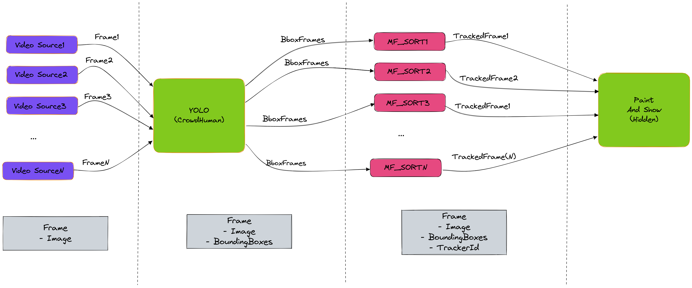

# MMLAPipeline-Resources
Demos, posters and other resources related to the [`ChimeraPy`](https://github.com/oele-isis-vanderbilt/ChimeraPy.git) MMLA Pipeline ecosystem for EngageAI Institute site visit 2023.

## Posters
1. [ChimeraPy and the MMLAPipeline](./posters/ChimeraPyPoster.pdf)

## Demos

### Multi-camera Streaming
[multi-camera.json](./demo-configs/multi-camera.json) includes the [`ChimeraPyOrchestrator`](https://github.com/oele-isis-vanderbilt/ChimeraPyOrchestrator.git) config streaming multiple web cameras. This requires 2 external webcams (along with the native webcams) connected to a `linux` and `windows` machine. In the manager, we also run a [`webrtc-chimerapy-node`](https://github.com/oele-isis-vanderbilt/webrtc-chimerapy-node.git).

The architecture is as follows:
 

https://github.com/oele-isis-vanderbilt/MMLAPipeline-Resources/assets/11476842/39bd9175-3a71-49b9-9f27-6c0b66bad9a5

### Gaze Detection with Screen Capture
[gaze-camera-screen.json](./demo-configs/gaze-camera-screen.json) is the [`ChimeraPyOrchestrator`](https://github.com/oele-isis-vanderbilt/ChimeraPyOrchestrator.git) configuration for capturing screen and webcam images on a remote machine, feeding it to a gaze detection network ([L2CS-Net](https://github.com/Ahmednull/L2CS-Net)) and displaying results in a local machine. The architecture is as follows:

https://github.com/oele-isis-vanderbilt/MMLAPipeline-Resources/assets/11476842/1fdfac0d-608b-46bd-bbd1-20fd684ee844

### Multi-video Tracking
[multi-video-tracking.json](./demo-configs/multi-video-tracking.json) is the [`ChimeraPyOrchestrator`](https://github.com/oele-isis-vanderbilt/ChimeraPyOrchestrator.git) configuration for tracking multiple objects in multiple videos. The architecture is as follows:

https://github.com/oele-isis-vanderbilt/MMLAPipeline-Resources/assets/11476842/bf6a2f6c-612c-4497-9d08-d42507219fef

### Embodied Learning
[embodied-learning.json](./demo-configs/embodied-learning.json) is the [`ChimeraPyOrchestrator`](https://github.com/oele-isis-vanderbilt/ChimeraPyOrchestrator.git) configuration for embodied learning. The architecture is as follows:

## Useful Links
- [`ChimeraPy`](https://github.com/oele-isis-vanderbilt/ChimeraPy/tree/EngageAIVisit2023): Distributed computing framework for Multimodal data written in Python

- [`ChimeraPyOrchestrator`](https://github.com/oele-isis-vanderbilt/ChimeraPyOrchestrator/tree/EngageAIVisit2023): Reusable Nodes and Orchestration Scheme/ Dashboard Application for ChimeraPy with JSON configuration

- [`MMLAPIPE`](https://github.com/oele-isis-vanderbilt/MMLAPIPE/tree/EngageAIVisit2023): Repository of shareable `ChimeraPy` pipelines
